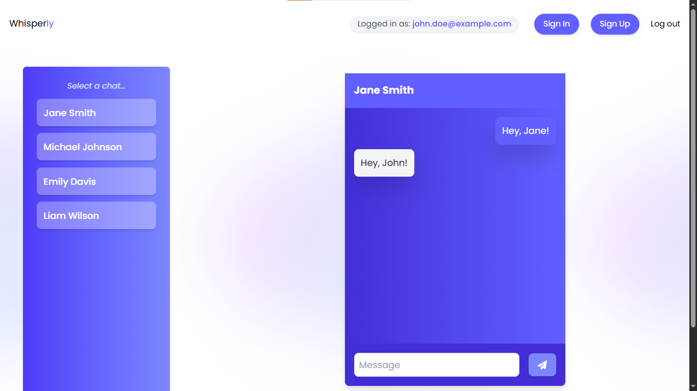
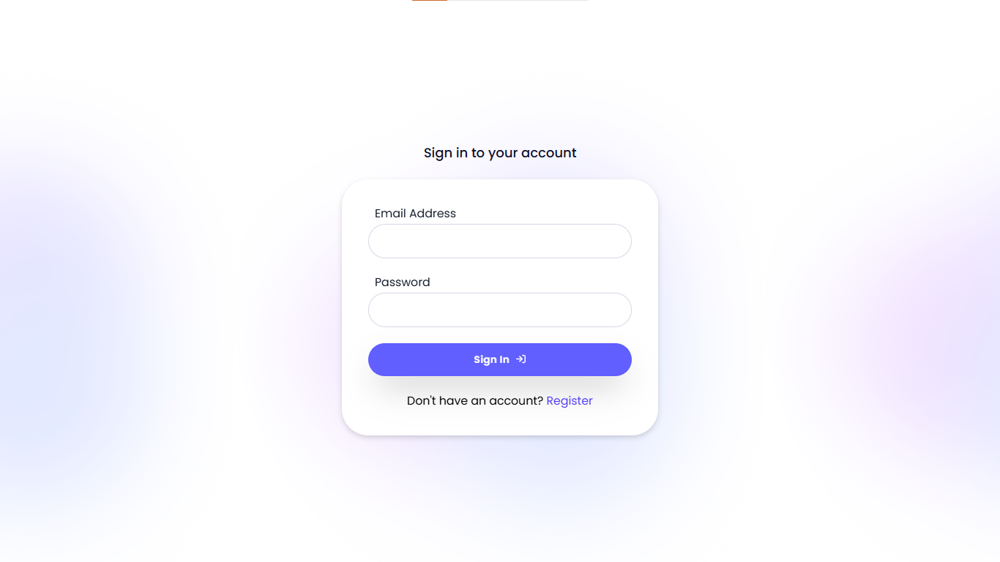
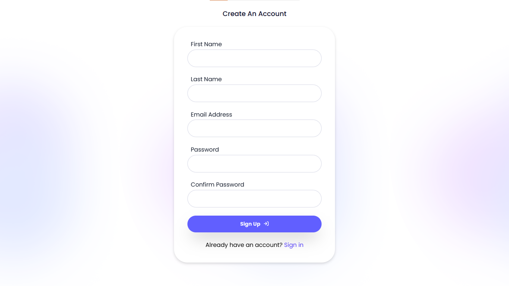

# 💬 Full-Stack Chat App

A real-time chat application built with the MERN stack (MongoDB, Express.js, React, Node.js). This app allows users to send and receive messages instantly, with support for user authentication, chat rooms, and responsive design.

## 🚀 Features

- 🔐 User Authentication (Login/Register)
- 📩 Real-time Messaging with Socket.io
- 💬 Private Chats
- 📱  Responsive UI (Mobile & Desktop Friendly)
- 🗃️ MongoDB for User Storage
- 🧾 Clean and minimal design


## 🛠️ Tech Stack

**Frontend**  
- ⚛️ React – Component-based UI library  
- 🎨 CSS & Tailwind CSS – Styling and responsive design  
- 🔗 Axios – HTTP client for API requests  

**Backend**  
- 🟢 Node.js – JavaScript runtime environment  
- 🚀 Express.js – Web framework for building APIs  
- 📡 Socket.io – Real-time communication  

**Database**  
- 🍃 MongoDB – NoSQL database for flexible data storage  
- 🧬 Mongoose – ODM for MongoDB, schema-based modeling


---

## 📦 Installation

1. Clone the repo:
```git clone https://github.com/saeedhalabi/Whisperly.git```
2. Install dependencies:

Client:
```cd client```
```npm install```

Server:
```cd server```
```npm install```

3. Environment variables

Create a ```.env``` file in the root of the server folder

```PORT=8080```
```MONGO_URI=<your-mongo-db-uri>```
```JWT_SECRET=<your-jwt-secret-key>```
```PEPPER=<your-pepper-string>```

4. Start the app

Server: ```npm run dev```
Client: ```npm run dev```

---

## 📸 Screenshots







---
<p align="center"><strong>Designed and developed by Saeed Halabi</strong></p>
